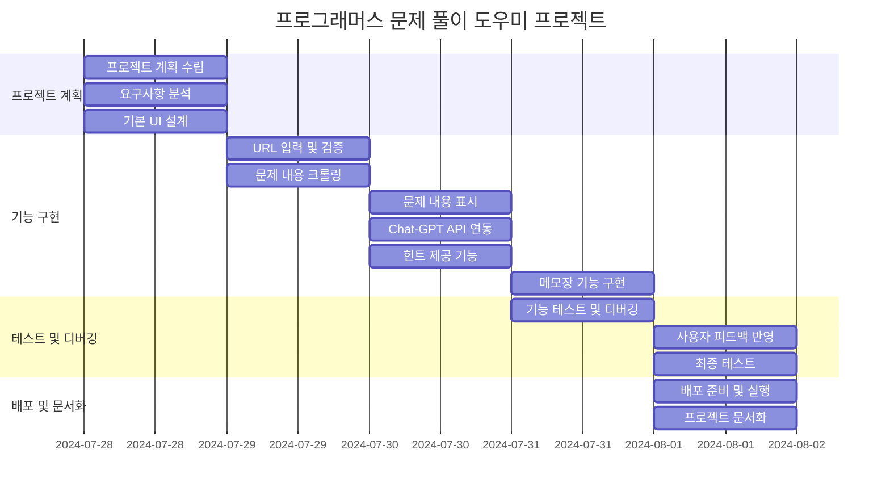
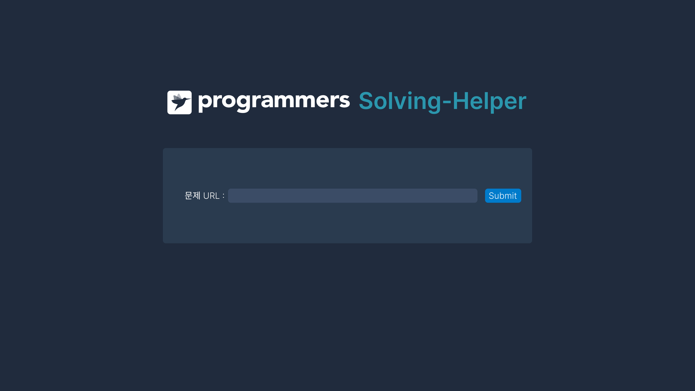
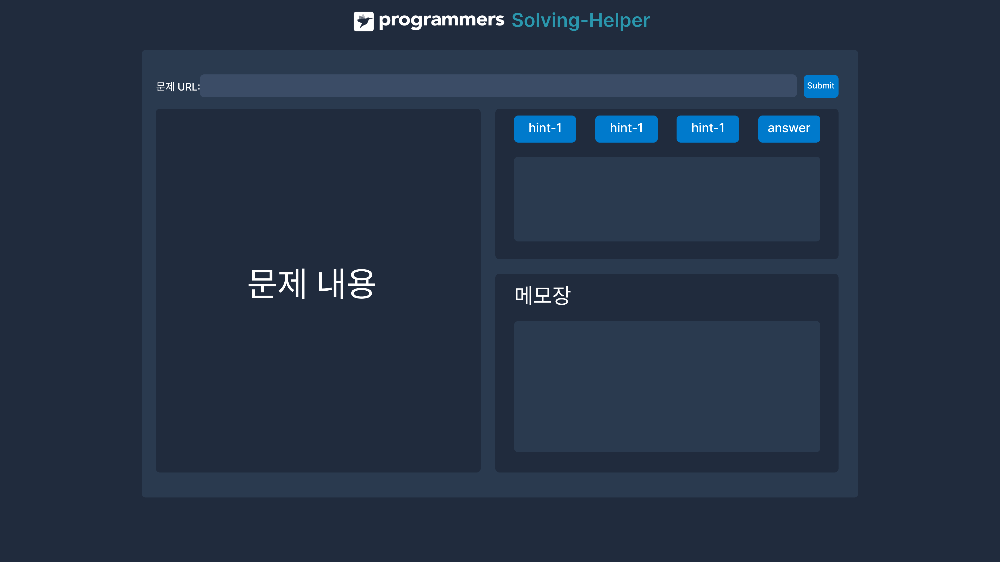
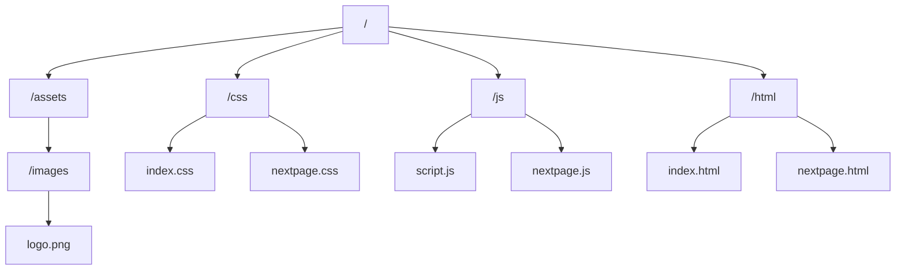
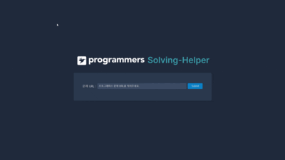

# coding_test_solving_helper
프로그래머스 문제 풀이 도우미 프로젝트입니다.
# 배포 주소
 

# WBS

# Wide Frame

# 프로젝트 구조

- 시작 화면 : index.html, index.css, script.js
- 힌트 화면 : nextpage.html, nextpage.css, nextpage.js
- 로고 이미지 : logo.png

# 시연 영상

# 1. 프로젝트 목적 및 배경
코딩 테스트를 처음 접하는 많은 사람들이 문제를 풀며 어려움을 겪습니다. 특히, 문제의 의도를 파악하거나 접근 방식을 생각해내것에 많은 시간을 소요합니다. 이 프로젝트는 이러한 문제를 해결하기 위해 기획되었습니다.

# 2. 프로젝트 설명
## 2.1 서비스 개요
이 웹 서비스는 사용자가 '프로그래머스' 문제 URL을 입력하면, 문제 내용을 보여주고, 문제 해결을 위한 힌트를 제공합니다.
'프로그래머스'에서 문제를 크롤링 해와서 문제를 표시하며, `Chat-GPT API`를 활용하여 문제 해결을 돕는 힌트를 제공합니다.
또한, 사용자들이 메모를 할 수 있는 공간도 마련되어 있습니다.

## 2.2 주요 기능 설명
- **문제 URL 입력 및 검증**: 사용자가 입력한 URL이 유효한지 검증하고, 유효한 경우에만 문제 내용을 크롤링합니다.
- **문제 내용 크롤링**: 문제 제목과 설명을 포함한 주요 내용을 크롤링하여 사용자에게 제공합니다.
- **힌트 제공**: Chat-GPT API를 통해 문제 해결에 도움이 되는 힌트를 제공합니다. 이는 사용자가 문제에 대한 이해를 돕습니다.
- **메모장 기능**: 사용자가 자신의 코드를 작성하고 정리할 수 있는 공간을 제공합니다. 이를 통해 사용자들은 자신의 풀이 과정을 체계적으로 기록할 수 있습니다.

## 2.3 기술 스택

- **HTML**: 웹페이지의 구조와 내용을 정의하는 데 사용되었습니다.
- **CSS**: 웹페이지의 스타일링을 위해 사용되었습니다. 반응형 디자인과 사용자 친화적인 UI를 구현하는 데 활용되었습니다.
- **JavaScript**: URL 입력 검증, 크롤링 데이터 처리, 힌트 표시 등을 구현했습니다.
- **GitHub** : 버전 관리 및 배포를 위해 사용했습니다.
- **Figma** : Wide Frame 제작에 사용했습니다.

# 3. 프로젝트 도중 있었던 시행착오
## 3.1 크롤링으로 받아온 것의 타입
 - 시행착오 내용 : 서버가 반환한 타입과 파싱을 시도한 타입이 달라서 에러가 발생했습니다.
 - 해결 방안 : .json() 메서드를 .text() 메서드로 수정하여 문제를 해결했습니다.
 - 깨달은 점 : 서버에서 반환하는 모든 데이터가 JSON형식일 것이라고 가정했으나, 실제로는 그렇지 않은 경우도 있다는 것을 깨달았습니다.

 ## 3.2 Chat-GPT의 할루시네이션 발생
  - 시행착오 내용 : 문제 URL을 제공하여 Chat-GPT가 해당 URL을 직접 검색한 후 힌트를 생성하도록 했습니다. 그러나 사용량이 많아지면서 제공된 URL을 검색하지 않고 힌트를 만들어내는 할루시네이션 현상이 발생했습니다.
  - 해결 방안 : 크롤링을 통해 얻은 문제 내용을 Chat-GPT에게 프롬프트로 제공하여 문제를 해결했습니다.

## 3.3 다른 함수의 변수 불러오기
 - 시행착오 내용 : Chat-GPT에게 문제 내용을 제공하기 위해 크롤링해온 'content'라는 변수를 다른 함수에서 사용하려 했습니다. 그러나 '함수명.변수명'으로 접근하려 하자 에러가 발생했습니다.
 - 해결 방안 : 크롤링 함수에서 'content' 변수를 반환하고, API 통신을 담당하는 함수에서 크롤링 함수를 호출하여 그 반환값을 새로운 변수에 저장하여 사용했습니다.

 ## 3.4 유지 보수 관련 문제
 - 시행착오 내용 :각 모듈을 개별적으로 구현하여 실행할 때는 문제가 없었으나, 모듈을 통합하자 예상치 못한 곳에서 에러가 빈번하게 발생했습니다.
 - 해결 방안 : 반복되는 내용과 비슷한 기능을 가진 부분을 묶어 기능별로 함수를 만들어 주었습니다.
 - 깨달은 점 : 함수를 연쇄적으로 사용하는 것이 유지 보수 및 가독성에서도 유리하다는 점을 깨달았습니다.

# 4. 한계점
## 4.1 한정된 사이트
 - 문제점 : 페이지 왼쪽편에는 문제 내역을 출력하기 때문에 프로그래머스 사이트에서만 작동합니다.
 - 해결 방안 : 근본적으로 Chat-GPT를 사용하는 웹 서비스이다보니,  사용량이 많아져도 URL을 서칭하도록 하면 해결이 되는 문제입니다. 다만, 토큰을 생각하면 소비자가 원하는 사이트 별로 직접 크롤링하여 프롬프트를 작성하는 것이 더 효율적으로 보입니다.

 ## 4.2 어려운 난이도의 문제를 풀지 못함
 - 문제점 : 프로그래머스 LV.4의 난이도의 경우 문제를 풀지 못하는 경우가 발생했습니다.
